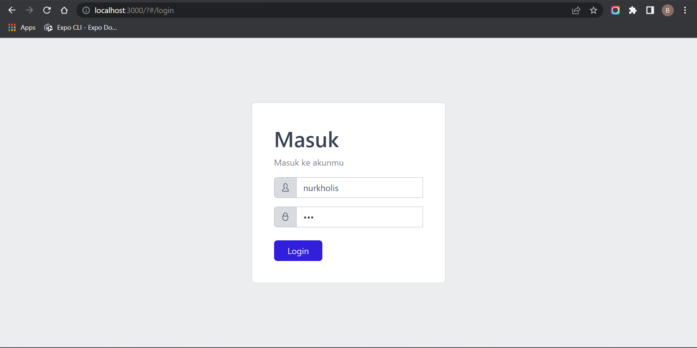
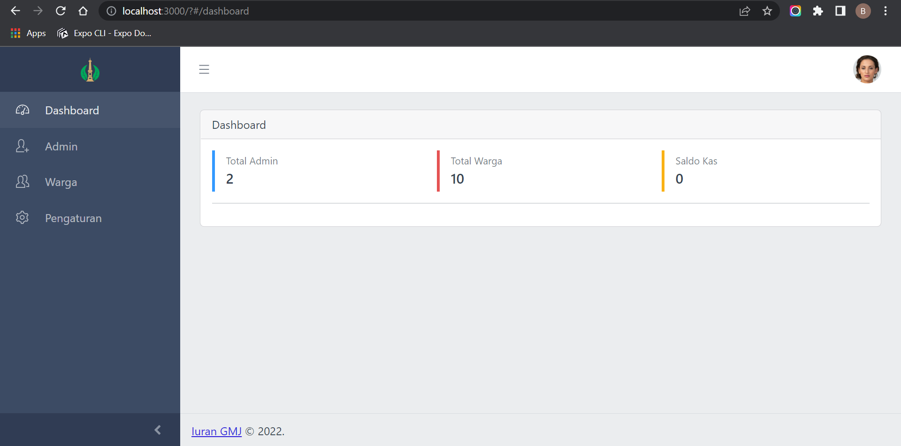
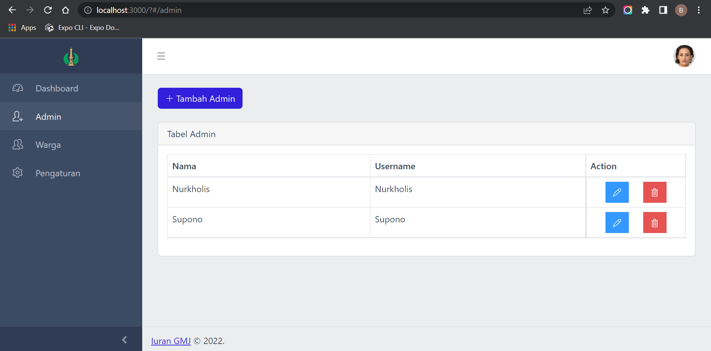
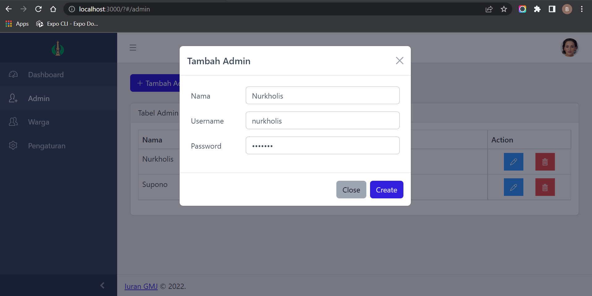
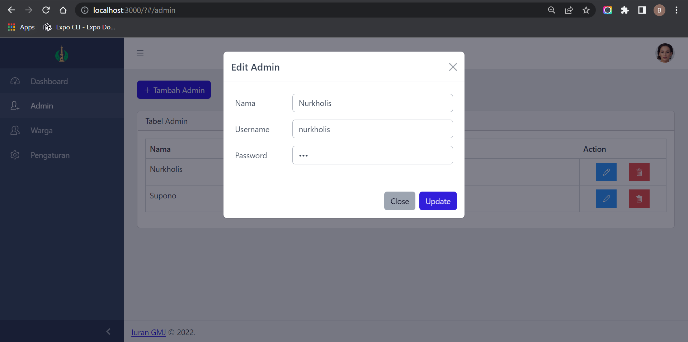
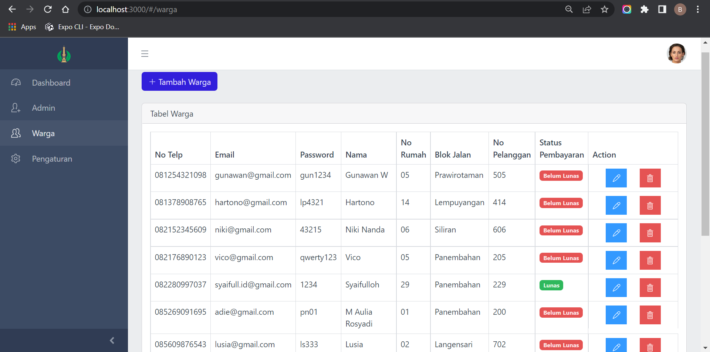
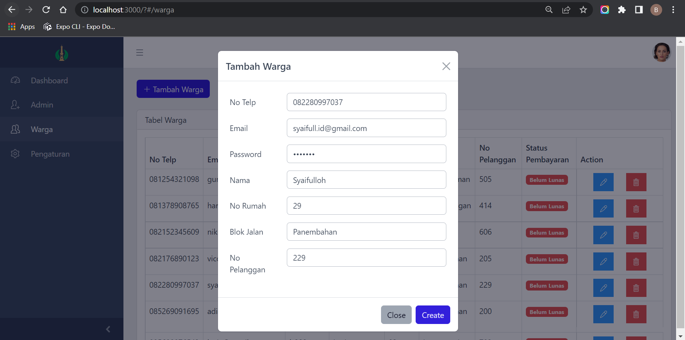
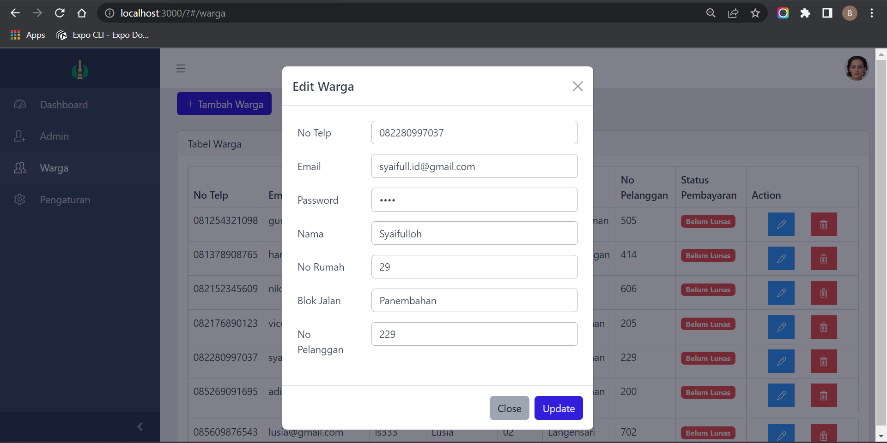
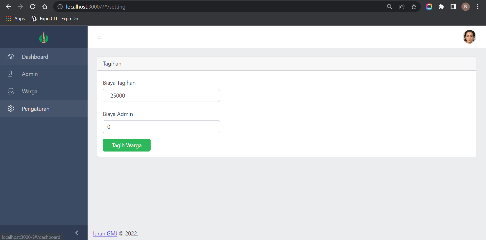
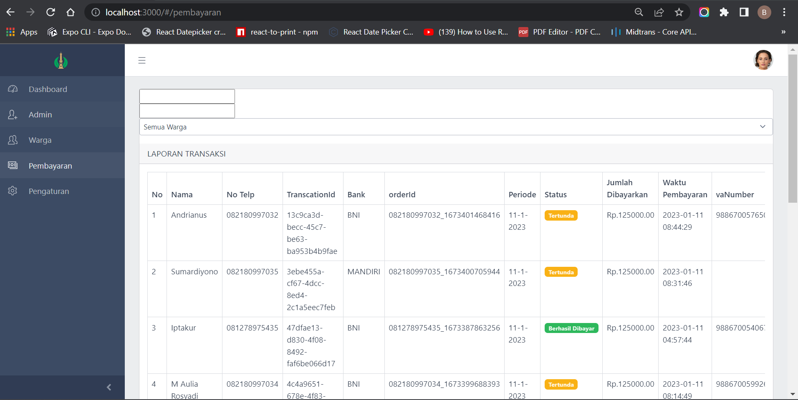

# Dhasboard Admin Aplikasi Pembayaran Iuran Warga Perumahan Berbasis Web 
(Studi Kasus: Perumahan Green Mutiara Java Regency)

Membuat Dhasboard Admin Aplikasi Pembayaran Iuran Warga Perumahan Berbasis Web untuk membantu Admin/Pengurus dalam  mengelolah data pembayaran dari warga yang masuk ke sistem.

### Library:

- React JS (coreui.io)

### Bahasa:

- JavaScript
- Node JS

### Software tool:

- Visual Studio Code

### Teknologi lainnya:

- Firebase

### Fitur:

- Login
- Dashboard
- Halaman Data Admin
- Tambah Data Admin
- Update Admin
- Menu Data Warga
- Tambah Data Warga
- Update Data Warga
- Pengaturan Tagihan
- Laporan Pembayaran

### Tutorial:

- npm install
- npm run start

# Preview

### Screenshot

### Dhasboard Admin Aplikasi Pembayaran Iuran Warga Perumahan Berbasis Web 

- Login

- Dashboard

- Halaman Data Admin

- Tambah Data Admin

- Update Admin

- Menu Data Warga

- Tambah Data Warga

- Update Data Warga

- Pengaturan Tagihan

- Laporan Pembayaran

